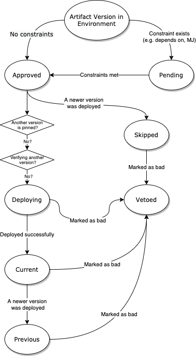

# Artifact versions

## State transitions

States of an artifact version in an environment:

## Notified via event

### REST endpoint

Keel receives information about new artifact versions by other services making POST calls to the `/artifacts/events` endpoint: `ArtifactController.submitArtifact`.

In Netflix's internal deployment: 

* Echo calls this endpoint to notify keel about new deb packages that have just been published.
* Igor calls this endpoint to notify keel about new Docker images that have just been published.

### ArtifactController

The `ArtifactController.submitArtifact` method filters out artifact types it doesn't know about, and then emits an `ArtifactPublishedEvent` Spring event.

### ArtifactListener

The `ArtifactListener.onArtifactPublished` method responds to the spring event. It makes a call which ultimately invokes the `SqlArtifactRepository.isRegistered` method, which checks if this artifact is associated with any managed applications.

If so, keel registers this version of the artifact.

# Periodic sync

The `ArtifactListener.syncArtifactVersions` method is scheduled to run every six hours and grabs the last recorded version of each managed artifact.

# Manual sync 

An operator can force keel to sync to the most recent artifact versions by making a POST call to the `/artifacts/sync` endpoint: `ArtifactController.sync`.

This call emits an `ArtifactSyncEvent` object that is handled by the `ArtifactListener.triggerArtifactSync`.
