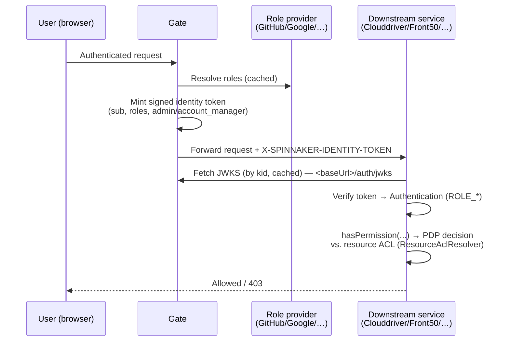
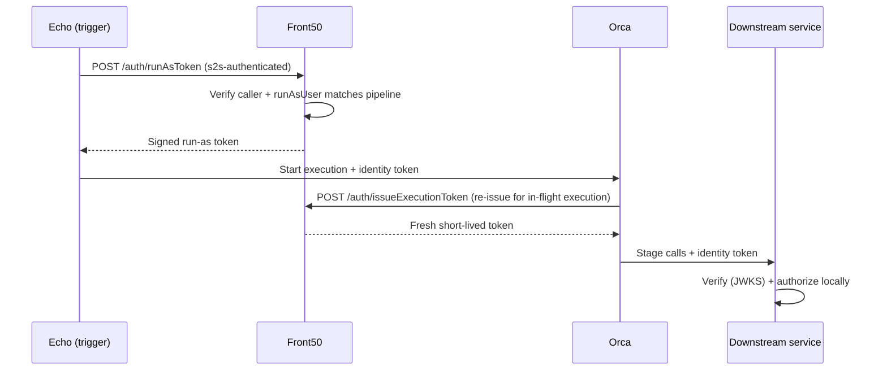

# Migrating from Fiat to the new authorization model

A quick-start for service owners moving off **Fiat** and onto Spinnaker's new
**decentralized, token-based authorization** model.

## TL;DR

| | Old (Fiat) | New (token-based) |
|---|---|---|
| Decision location | Remote Fiat permission service + central Redis cache | **In-process, per service** (owner-local) |
| Permission data | Materialized `UserPermission` per user | Resource's embedded `Permissions` ACL, resolved on demand |
| Identity between services | Unsigned `X-SPINNAKER-USER` / `-ACCOUNTS` headers | **Signed JWT** (`X-SPINNAKER-IDENTITY-TOKEN`), verified via JWKS |
| Who mints identity | Fiat / Gate (implicit) | **Gate** (interactive users) + **Front50** (run-as) only |
| Service-to-service trust | Implicit network trust | mTLS / mesh / K8s SA token + codified `@AllowServiceCallers` |
| Master toggle | `services.fiat.enabled` | `authz.enabled` |
| Extensibility | Fiat-specific | Pluggable `PolicyDecisionPoint` behind Spring `PermissionEvaluator` |

The new model lives in `kork-authz`, `kork-roles`, and `kork-security`. It is
**inert by default** — importing the modules changes nothing until you opt in.

## Concepts you need to know

- **PEP — `PolicyDecisionPointPermissionEvaluator`**: a Spring Security
  `PermissionEvaluator` registered as bean `spinnakerPermissionEvaluator`, so
  existing `@PreAuthorize("hasPermission(...)")` / `@PostFilter` annotations keep
  working. Each service has a subclass (`GatePermissionEvaluator`, etc.).
- **PDP — `PolicyDecisionPoint`**: the swappable decision engine. Ships with
  `spring-acl` (default) and `legacy` (behavior-preserving fallback). OPA /
  OpenFGA / Cerbos can slot in here later without touching call sites.
- **`ResourceAclResolver`**: each owning service implements this to return a
  resource's `Permissions` (its ACL) by type + name. ACLs are synthesized
  on the fly — **no ACL data migration required**.
- **Identity tokens**: short-lived signed JWTs carrying `sub`, `roles`, and
  `admin` / `account_manager` flags. Minted only by Gate and Front50; verified
  locally by every service using JWKS published at `<service>/auth/jwks`.

## Migration steps

Flip these flags in order. Each step is safe to sit on before advancing.

### 1. Baseline (default — behaves like `services.fiat.enabled=false`)

```yaml
authz:
  enabled: false
```

Every `hasPermission(...)` short-circuits to allow; absent/invalid tokens fall
back to legacy unsigned headers. No keys or tokens needed. Start here.

### 2. Configure identity (so tokens can flow before you enforce)

```yaml
authz:
  signing:
    keys: [ <RSA private JWK JSON, each with a "kid"> ]   # shared by Gate + Front50
    active-key-id: <kid>

services:
  gate:
    baseUrl: https://gate.example.com     # verifiers derive <baseUrl>/auth/jwks
  front50:
    baseUrl: https://front50.example.com
```

Optionally configure a role provider (otherwise Gate trusts the roles the auth
mechanism asserts):

```yaml
auth:
  group-membership:
    service: github
    github:
      base-url: https://api.github.com
      access-token: <token>
      organization: my-org
```

### 3. Turn on service-to-service auth (required before enforcing)

```yaml
authz:
  s2s:
    enabled: true
    provider: x509-subject   # or: header | k8s-sa-token
```

This makes `@AllowServiceCallers` enforce (403 on disallowed callers) and lets
Echo's run-as token minting authenticate. See
[`s2s/README.md`](src/main/java/com/netflix/spinnaker/security/s2s/README.md)
for transport config (mTLS keystores, mesh header, K8s audiences).

> **Important:** enabling `authz.enabled` without `authz.s2s.enabled=true`
> leaves privileged internal endpoints (e.g. Front50's run-as mint) trusting any
> valid identity token. Always enable s2s alongside authorization.

#### s2s providers

Pick the provider that matches how your peers already authenticate:

- `x509-subject` — CA/mTLS; read the service name from the client cert subject DN.
- `header` — service mesh (Istio/Linkerd); read the mesh-injected identity header.
- `k8s-sa-token` — plain Kubernetes, no certificates (see below).

#### Kubernetes ServiceAccount token path (`k8s-sa-token`)

Use this on plain Kubernetes installs where you don't run mTLS or a mesh. Each
service authenticates as its own ServiceAccount via an audience-bound projected
token, verified offline against the cluster JWKS.

**1. Give each service its own ServiceAccount** (`spin-orca`, `spin-echo`, …) so
the token subject `system:serviceaccount:<namespace>:<name>` maps to the right
`SpinnakerService` (the `spin-` prefix is stripped via `authz.s2s.service-name-prefix`).

**2. Mount an audience-bound projected token** in each pod spec, and mount it
where the calling side expects to read it (`authz.s2s.k8s.token-path`, default
`/var/run/secrets/spinnaker/identity/token`). Keep the TTL short — it is the
only mitigation against a leaked token (there is no offline revocation), and
Kubernetes auto-rotates it before expiry:

```yaml
volumes:
  - name: spin-identity-token
    projected:
      sources:
        - serviceAccountToken:
            audience: spinnaker          # must match authz.s2s.k8s.audiences
            expirationSeconds: 3600      # keep short; auto-rotated
            path: token
# ...and in the container:
volumeMounts:
  - name: spin-identity-token
    mountPath: /var/run/secrets/spinnaker/identity
    readOnly: true
```

Do **not** point `token-path` at the default
`/var/run/secrets/kubernetes.io/serviceaccount/token`: that token is bound to
the Kubernetes API server's audience, so peers will reject it (`audiences` is
matched), and mounting it for this purpose would make an API-server credential
reachable by every service you call.

**3. Configure the resolver:**

```yaml
authz:
  s2s:
    enabled: true
    provider: k8s-sa-token
    service-name-prefix: spin-           # spin-orca -> ORCA
    k8s:
      namespace: spinnaker              # required namespace of calling ServiceAccounts
      audiences: [ spinnaker ]          # required — resolver is disabled without it
      # jwks-uri: https://kubernetes.default.svc/openid/v1/jwks   # default
      # issuer: https://...                        # optional; must equal the token's `iss`
      # jws-algorithms: [ RS256 ]                  # default; some clusters use [ ES256 ]
```

**No RBAC needs to be granted.** The default `jwks-uri` is the in-cluster API
server, which every ServiceAccount may already read (Kubernetes ships a
`system:service-account-issuer-discovery` ClusterRoleBinding for the
`system:serviceaccounts` group). The verifying service trusts that endpoint via
the cluster CA projected into every pod and authenticates the fetch with its own
token, both at defaulted paths — so this works out of the box with no manifest
changes beyond the projected volume in step 2.

**4. Callers send the token automatically.** `ServiceIdentityClientConfiguration`
publishes a `ServiceIdentityInterceptor` that reads the token file (re-reading it
every `token-refresh-seconds` so rotation is picked up) and attaches it on
`X-Service-Identity-Token` (override via `authz.s2s.k8s.token-header`).

The interceptor is attached per client, only to clients that target another
Spinnaker service — it is deliberately *not* a global OkHttp customizer, because
those apply to every client in the process including artifact fetches to GitHub,
S3, and other third parties, which would send this credential off-cluster. If
you add a new internal client that calls an `@AllowServiceCallers` endpoint, you
must inject the interceptor and `addInterceptor(...)` it onto that client; see
Orca's `Front50Configuration` and Echo's `runAsTokenClient` for the pattern.

Notes:
- `audiences` is **required** — without it the resolver stays disabled, so a token
  minted for another audience (e.g. the Kubernetes API server) can't be replayed.
- `namespace` is matched, so a same-named ServiceAccount in another namespace
  cannot impersonate a Spinnaker service.
- Verification is **offline**, so it cannot tell that a Pod-bound token's Pod is
  gone, and there is no revocation path: keep `expirationSeconds` short. The
  stronger `TokenReview` API is deliberately not used because it can only be
  granted via a cluster-scoped `ClusterRoleBinding` to `system:auth-delegator`,
  which is too heavy an install requirement; prefer `x509-subject` or a mesh if
  you need bound-claim validation.
- JWKS fetches are bounded by `k8s.jwks-connect-timeout-ms` /
  `k8s.jwks-read-timeout-ms` / `k8s.jwks-size-limit-bytes` so a slow or hostile
  endpoint can't stall request threads.

See [`s2s/README.md`](src/main/java/com/netflix/spinnaker/security/s2s/README.md)
for the full config table and the mTLS / mesh alternatives.

### 4. Enforce authorization

```yaml
authz:
  enabled: true
  strict: true   # role-only decisions fail closed; set false for a softer rollout
```

Now a valid signed token is required (absent/invalid → anonymous), decisions are
made locally against token roles + resource ACLs, and startup fails fast if keys
aren't configured.

### 5. (Optional) Pick the decision backend and extras

```yaml
authz:
  pdp:
    provider: spring-acl                    # or: legacy
    allow-access-to-unknown-applications: false
```

Global default application grants — the replacement for Fiat's "aggregate" /
prefix `*` behavior — are configured in **Front50 only**:

```yaml
# front50-local.yml
authz:
  application:
    default-permissions:
      READ: [ everyone ]
      WRITE: [ admins ]
```

Front50 owns application ACLs, so it is the one service that can apply the
defaults authoritatively. Services that check application permissions without
owning them (Clouddriver, Orca) read the *effective* ACL from
`GET /permissions/applications/{app}?effective=true`, with the defaults already
folded in; they hold no copy of this config and therefore cannot drift from the
decision Front50 would make. Front50 stores each application's own grants with
the defaults subtracted out, so a client that reads the effective ACL and saves
it back — Deck's application edit form does exactly this on every save — does
not silently promote a default into a permanent per-application grant.

## Config reference

| Prefix | Purpose |
|---|---|
| `authz.enabled` | Master switch (default `false`). |
| `authz.strict` | Fail-closed for role-only decisions (default `true`). |
| `authz.pdp.provider` | `spring-acl` (default) or `legacy`. |
| `authz.pdp.allow-access-to-unknown-applications` | Legacy fallback for apps with no ACL (default `false`). |
| `authz.application.default-permissions.*` | Global default application grants. **Front50 only** — other services read them via `?effective=true`. |
| `authz.s2s.enabled` / `authz.s2s.provider` | Service-to-service auth on/off + provider. |
| `authz.signing.keys` / `authz.signing.active-key-id` | RSA signing keys (Gate + Front50); supports zero-downtime rotation. |
| `authz.verifier.*` | JWKS fetch timeouts / size limits. |
| `authz.token.{issuer,audience,validity,clock-skew}` | Token claim/validity settings. |
| `authz.roles.merge-external-roles` | Merge provider roles with asserted roles (default `true`). |
| `authz.runas.enabled` | Front50 run-as / token endpoints (default on). |
| `authz.api-token-exchange.enabled` | Swap opaque `spk_` tokens for identity tokens (default `false`). |
| `authz.gate.admin-roles` / `authz.gate.account-manager-roles` | Roles that grant admin / account-manager. |
| `authz.service-accounts.filter` | Canonical replacement for deprecated `fiat.service-accounts.filter`. |
| `auth.group-membership.*` | Role provider selection (github / google / file / …). |

Deck reads `AUTHZ_ENABLED` (or `VITE_AUTHZ_ENABLED`) to toggle authorization UI.

## How a request flows end-to-end

### Interactive user request



### Automated (triggered) pipeline



## Per-service breakdown

Only **Gate** and **Front50** hold signing keys and serve `/auth/jwks`.
Everyone else is **verify-only** (fetches JWKS by `kid` and checks tokens locally).

### Gate — mints interactive-user tokens
- Resolves roles (via `UserRolesResolver`), caches them, derives `admin` /
  `account_manager`, and mints the interactive-user identity token.
- Serves public keys at `GET /auth/jwks`; optionally exchanges opaque `spk_`
  API tokens for identity tokens.
- Classes: `GateIdentityService`, `IdentityTokenConfiguration`,
  `IdentityTokenJwksController`, `IdentityTokenPropagationFilter` (re-mints and
  stamps the token for outbound calls), `GatePermissionEvaluator`,
  `GateAuthorizationConfig`, `GateAuthzProperties`.
- Config: `authz.gate.admin-roles`, `authz.gate.account-manager-roles`,
  `authz.signing.*`, `authz.api-token-exchange.*`.

### Front50 — mints run-as tokens + owns application/service-account ACLs
- The token authority for async execution. `RunAsTokenController` exposes
  `POST /auth/runAsToken` (initial mint for a trigger; caller `@AllowServiceCallers({ECHO, ORCA})`),
  `POST /auth/issueExecutionToken` (re-issue for an in-flight execution;
  `@AllowServiceCallers(ORCA)`), and `GET /auth/jwks`.
- Resolves ACLs for `application` and `service_account` resources from its own
  domain model.
- Classes: `RunAsTokenController`, `RunAsTokenProperties`,
  `Front50PermissionEvaluator`, `Front50ResourceAclResolver`,
  `Front50SecurityConfig`.
- Config: `authz.runas.enabled` (default on), `authz.signing.*`.

### Echo — verify-only, bootstraps trigger tokens
- Holds **no** signing key. For triggered pipelines it calls Front50's
  `POST /auth/runAsToken` (authenticating via s2s), then stamps the returned
  token onto the outbound Orca call. Re-mints per attempt to keep tokens short-lived.
- **Requires `authz.s2s.enabled=true`** (it has no key to prove itself otherwise).
- Classes: `RunAsTokenService`, `RunAsTokenClient`, `RunAsTokenRequest`,
  `RunAsTokenResponse`, `EchoSecurityConfig`.

### Orca — verify-only, relays identity across async boundaries
- Holds **no** signing key. Relays the admitted subject/roles for an in-flight
  execution and asks Front50 to re-issue a fresh token
  (`POST /auth/issueExecutionToken`) so the grant survives async stage boundaries
  without a long-lived, replayable token.

### Clouddriver — verify-only, authorizes accounts + applications
- Authorizes `account` (resolved locally) and `application` (resolved by calling
  Front50). A `CompositeResourceAclResolver` fans out to the per-type resolvers.
- Classes: `ClouddriverPermissionEvaluator`, `ClouddriverResourceAclResolver`,
  `CompositeResourceAclResolver`, `Front50ApplicationAclResolver`,
  `ClouddriverSecurityConfig`.

### Igor — verify-only, authorizes build services
- Authorizes `build_service` resources. Wires its own `CompositeJWKSource`.
- Classes: `IgorPermissionEvaluator`, `IgorResourceAclResolver`,
  `IgorSecurityConfig`, `IgorAuthzProperties`, `CompositeJWKSource`.

### Signing-key vs verify-only summary

| Service | Signing key? | Serves `/auth/jwks`? | Owns which ACLs |
|---|---|---|---|
| Gate | Yes (interactive users) | Yes | — (mints, propagates) |
| Front50 | Yes (run-as) | Yes | `application`, `service_account` |
| Echo | No | No | — |
| Orca | No | No | — |
| Clouddriver | No | No | `account`, `application` (via Front50) |
| Igor | No | No | `build_service` |

## Key rollback safety

- The modules are inert while `authz.enabled=false` — safe to deploy ahead of cutover.
- `authz.pdp.provider=legacy` gives a behavior-preserving decision path for A/B comparison.
- Signing keys support add-then-rotate, so you can roll keys with zero downtime.
